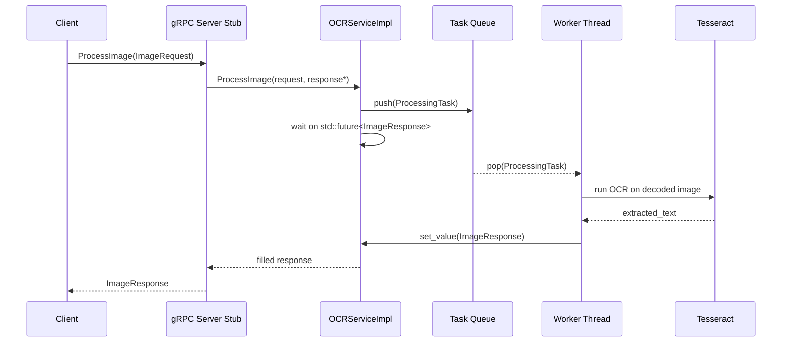
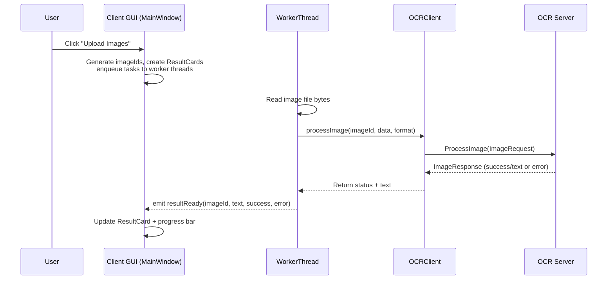

# Distributed OCR System – Architecture Overview

This document explains the architecture of the distributed OCR system from a **code analyst**, **senior developer**, and **project manager** perspective. It focuses on how the client and server collaborate, how work is parallelized, and how the system meets the STDISCM Problem Set 4 requirements.

---

## 1. High-Level System Architecture

At the highest level, the system is a **client–server distributed application**:

- **Client (`client/`)**
  - Qt6 GUI desktop app.
  - Lets users upload images, sends them to the server via gRPC, and shows OCR results as they arrive.
  - Manages **batches**, progress tracking, and user experience.

- **Server (`server/main.cpp`)**
  - Long-running gRPC service.
  - Uses a pool of worker threads to run an OCR pipeline (Leptonica + Tesseract).
  - Processes many images concurrently and streams or returns results.

- **Shared contract (`proto/ocr.proto`)**
  - gRPC service: `OCRService`.
  - Messages: `ImageRequest`, `ImageResponse`.

### 1.1 System Component Diagram

```mermaid
flowchart LR
    subgraph ClientMachine[Client Machine]
        GUI[Qt GUI<br/>MainWindow]
        WC[Worker Threads<br/>(OCRWorkerThread)]
        GC[OCRClient<br/>(gRPC Stub)]
    end

    subgraph Network[Network]
        GRPC[gRPC over HTTP/2]
    end

    subgraph ServerMachine[Server Machine]
        GRPCS[OCRServiceImpl<br/>(gRPC Service)]
        Q[ThreadSafeQueue<ProcessingTask>]
        W1[Worker Thread 1]
        W2[Worker Thread 2]
        WN[Worker Thread N]
        OCR[Tesseract + Leptonica]
    end

    GUI --> WC
    WC --> GC
    GC --> GRPC
    GRPC --> GRPCS
    GRPCS --> Q
    Q --> W1
    Q --> W2
    Q --> WN
    W1 --> OCR
    W2 --> OCR
    WN --> OCR
    GRPCS --> GRPC
    GRPC --> GC
    GC --> GUI
```

---

## 2. Protocol and Data Model (`proto/ocr.proto`)

The protocol defines how client and server talk:

- **Service**
  - `rpc ProcessImage(ImageRequest) returns (ImageResponse);`
  - `rpc ProcessImageStream (stream ImageRequest) returns (stream ImageResponse);` (available for future streaming extensions).

- **ImageRequest**
  - `image_id` – logical key for an image.
  - `image_data` – binary image bytes (PNG/JPEG).
  - `image_format` – `"png"`, `"jpg"`, `"jpeg"`, etc.

- **ImageResponse**
  - `image_id` – echoes the request’s ID.
  - `extracted_text` – OCR output or error text.
  - `success` / `error_message` – status reporting.

From a **PM perspective**, this is your **API contract**: any new client (CLI, web UI, etc.) can integrate by conforming to `ocr.proto`.

---

## 3. Server Architecture (`server/main.cpp`)

### 3.1 Responsibilities

- Accept image-processing requests over gRPC.
- Run OCR pipeline in parallel using multiple worker threads.
- Return OCR results as soon as each image finishes (independent of others).

### 3.2 Key Components

- **`OCRWorker`**
  - Wraps a `tesseract::TessBaseAPI` instance.
  - Converts `image_data` bytes → Leptonica `PIX` → OCR text.
  - Handles format-specific loading (`pixReadMemPng`, `pixReadMemJpeg`).

- **`ThreadSafeQueue<ProcessingTask>` (server-local)**
  - In-file generic queue with `push`, `tryPop`, `waitAndPop`.
  - Synchronization via `std::mutex` + `std::condition_variable`.

- **`ProcessingTask`**
  - Carries:
    - `image_id`, `image_data`, `image_format`.
    - A pointer to the gRPC `ServerReaderWriter` stream and a mutex for safe writes.

- **`OCRServiceImpl`**
  - Owns:
    - The **task queue**.
    - The vector of **worker threads**.
    - A vector of `OCRWorker` instances (one per worker thread).
  - Implements:
    - `ProcessImageStream`: streams requests in, enqueues tasks, and lets workers stream responses back.
    - `ProcessImage`: simple unary RPC path for one-off requests.

- **`RunServer`**
  - Bootstraps `OCRServiceImpl`, binds the port, and calls `server->Wait()` to run indefinitely.

### 3.3 Server Concurrency Model

```mermaid
flowchart LR
    subgraph Server
        RPC[RPC Handler<br/>(ProcessImage)]
        Q[ThreadSafeQueue<ProcessingTask>]
        W1[Worker Thread 1]
        W2[Worker Thread 2]
        WN[Worker Thread N]
    end

    RPC -->|push(task)| Q
    Q --> W1
    Q --> W2
    Q --> WN
```

From a **senior developer** view:

- The RPC handler stays **lightweight** (decode → enqueue → wait on `std::future`).
- Work is pushed to worker threads so gRPC threads are not doing heavy CPU/OCR.
- This scales vertically: increasing worker count increases throughput on multi-core CPUs.

### 3.4 Server Request Lifecycle (Unary RPC)



From a **PM lens**, the important behavior is:

- Each image is independent.
- Latency is bounded mainly by:
  - queue wait time (load), and
  - OCR time (complexity/quality of image).

---

## 4. Client Architecture (`client/`)

### 4.1 Responsibilities

- Provide a **responsive GUI** for:
  - Selecting and uploading images.
  - Showing OCR results as they arrive.
  - Tracking progress across batches.
- Run network calls off the UI thread so the app stays responsive.

### 4.2 Key Components

- **`MainWindow`**
  - Owns the UI:
    - `QProgressBar` for overall progress.
    - `QScrollArea` with a grid of `ResultCard` widgets.
    - “Upload Images” button.
  - Maintains batch state:
    - `totalImages_`, `pendingImages_`, `completedImages_`.
  - Distributes work to **OCR worker threads** and reacts to their `resultReady` signals.

- **`ResultCard`**
  - A small widget representing one image’s OCR result.
  - Initially shows **“In progress”**, then the first line of detected text (plus optional detail line).

- **`OCRClient`**
  - Thin gRPC wrapper around `ocr::OCRService::Stub`.
  - Synchronous `processImage(image_id, image_data, format, extracted_text)` call:
    - Configures a gRPC `ClientContext` with a 60s deadline.
    - Calls the server’s `ProcessImage` RPC.
    - Handles network errors, reconnects when needed.

- **`OCRWorkerThread`**
  - Subclass of `QThread`.
  - Owns a queue (`QQueue<Task>`) of image processing tasks.
  - For each task:
    - Reads the image file into memory.
    - Calls `OCRClient::processImage`.
    - Emits `resultReady(imageId, text, success, error)` back to the GUI.

### 4.3 Client Concurrency Model

```mermaid
flowchart LR
    GUI[MainWindow<br/>UI Thread]
    subgraph Workers[OCR Worker Threads]
        WT1[OCRWorkerThread 1]
        WT2[OCRWorkerThread 2]
        WTN[OCRWorkerThread N]
    end
    OC[OCRClient (gRPC)]

    GUI -->|enqueue tasks| WT1
    GUI --> WT2
    GUI --> WTN
    WT1 --> OC
    WT2 --> OC
    WTN --> OC
    WT1 -->|resultReady signal| GUI
    WT2 -->|resultReady signal| GUI
    WTN -->|resultReady signal| GUI
```

The **Qt signal/slot** mechanism ensures that UI updates (`onResultReady`) are executed safely on the main thread.

### 4.4 Batch and Progress Logic

From the **spec**:

- Show results as soon as an image is processed.
- Allow uploading more images while a batch is in progress.
- Once all images are completed (progress 100%), new uploads are considered a **new batch** and previous results are cleared.

Implementation details:

- On upload:
  - If the progress bar is at 100%, `startNewBatch()` is called, which clears:
    - All result cards,
    - Image-path and tracking maps/sets,
    - Counters.
  - Each new image gets a generated `imageId` (`QUuid`) and is assigned to a worker thread.

- On `resultReady`:
  - The image moves from `pendingImages_` to `completedImages_`.
  - The corresponding `ResultCard` switches from “In progress” to either:
    - OCR text, or
    - Error message.
  - The progress bar is updated; when completion hits 100% and no pending images remain, `onBatchComplete` is triggered.

### 4.5 End-to-End Flow (User Perspective)



---

## 5. Threading, Synchronization, and Safety

### 5.1 Server-Side

- **ThreadSafeQueue**
  - Uses a mutex and condition variable to ensure:
    - Producers (`ProcessImage` / `ProcessImageStream`) and consumers (worker threads) coordinate safely.
    - No busy-waiting; worker threads sleep while the queue is empty.

- **Worker Threads**
  - Each worker:
    - Owns its own `OCRWorker` / Tesseract instance, avoiding shared-state contention inside the OCR engine.

- **gRPC Stream Writes**
  - For the streaming RPC, each `ProcessingTask` carries a `stream_mutex` pointer.
  - Workers lock this mutex before writing to the stream, preventing concurrent writes from interleaving.

### 5.2 Client-Side

- **Qt’s Signal/Slot Thread-Safety**
  - `OCRWorkerThread` emits `resultReady` with `Qt::QueuedConnection`, marshaling updates to the main GUI thread.
  - All UI widgets (`ResultCard`, `QProgressBar`) are touched only from the main thread.

- **Shared State**
  - Structures like `pendingImages_`, `completedImages_`, and `cards_` are only mutated from the UI thread, simplifying synchronization.

From a **senior developer** standpoint, this keeps concurrency **localized**:

- Complex, low-level synchronization is mostly on the server and within worker threads.
- The client avoids fine-grained locking by confining shared UI state to the main thread.

---

## 6. Non-Functional Qualities

### 6.1 Scalability

- **Vertical scalability**:
  - Increase `num_workers` when starting the server (e.g., `./ocr_server 0.0.0.0:50051 8`).
  - More CPU cores → more worker threads → higher throughput.

- **Horizontal scalability (conceptual)**:
  - Because the protocol is clean and stateless per request, multiple server instances could be fronted by a load balancer (not implemented here, but the design permits it).

### 6.2 Fault Tolerance & Resilience

- Network timeouts and connectivity issues:
  - Client sets per-request deadlines.
  - Errors surface to the GUI so users can see that a request failed.

- Server robustness:
  - Worker threads catch exceptions around OCR operations and return structured error messages.

### 6.3 Maintainability

- **Clear separation of concerns**:
  - GUI layout and batch logic isolated in `MainWindow`.
  - Networking isolated in `OCRClient`.
  - OCR pipeline isolated on the server side.

- **Extensibility**:
  - Adding support for more image formats or languages is localized to:
    - `OCRWorker` (server side) and possibly client-side suffix/format handling.
  - Adding metrics, logging, or additional RPCs can be done without changing core UI flow.

---

## 7. How to Reason About Changes

From a **project manager / lead** standpoint, here’s how to think about future changes:

- **UI-only changes** (look & feel, layout):
  - Mostly confined to `client/mainwindow.*` and `ResultCard`.

- **Networking / connection handling** (retry logic, health checks):
  - Confined to `client/ocr_client.*` and possibly additional RPCs in `proto/ocr.proto`.

- **OCR pipeline improvements** (preprocessing, accuracy):
  - Confined to the server’s worker code in `server/main.cpp`.

- **Performance tuning**:
  - Server: adjust `num_workers`, optimize OCR, add batching.
  - Client: tune number of `OCRWorkerThread` instances and queue behavior.

This separation keeps the system **evolvable** without cross-cutting changes across UI, networking, and processing layers.

---

## 8. Summary

- The system is a **distributed, multi-threaded OCR pipeline** with:
  - A Qt-based client handling user interaction and batching.
  - A gRPC-based server handling CPU-heavy OCR work in parallel.
  - A well-defined Protocol Buffers contract for interoperability.
- The architecture intentionally balances:
  - **Responsiveness** (UI stays smooth),
  - **Throughput** (worker pools on the server),
  - **Maintainability** (clear separation of concerns).

Use this document, together with `IMPLEMENTATION.md`, `README.md`, and `QUICKSTART.md`, as the reference when explaining the design in presentations or documentation, or when planning extensions and refactors.


